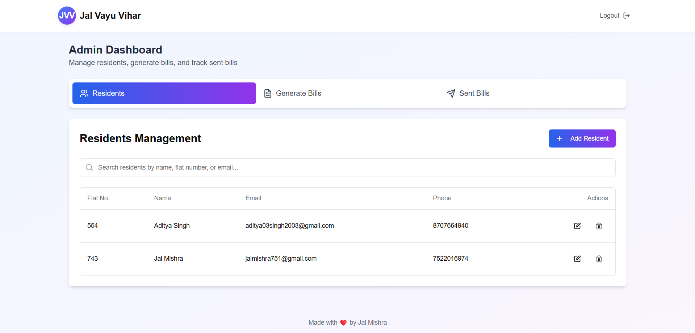
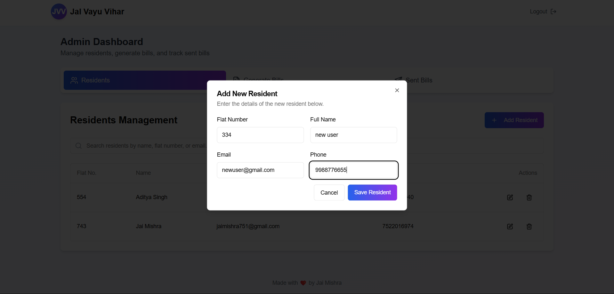
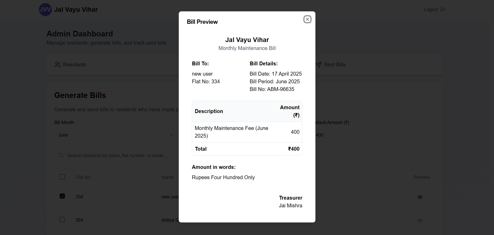
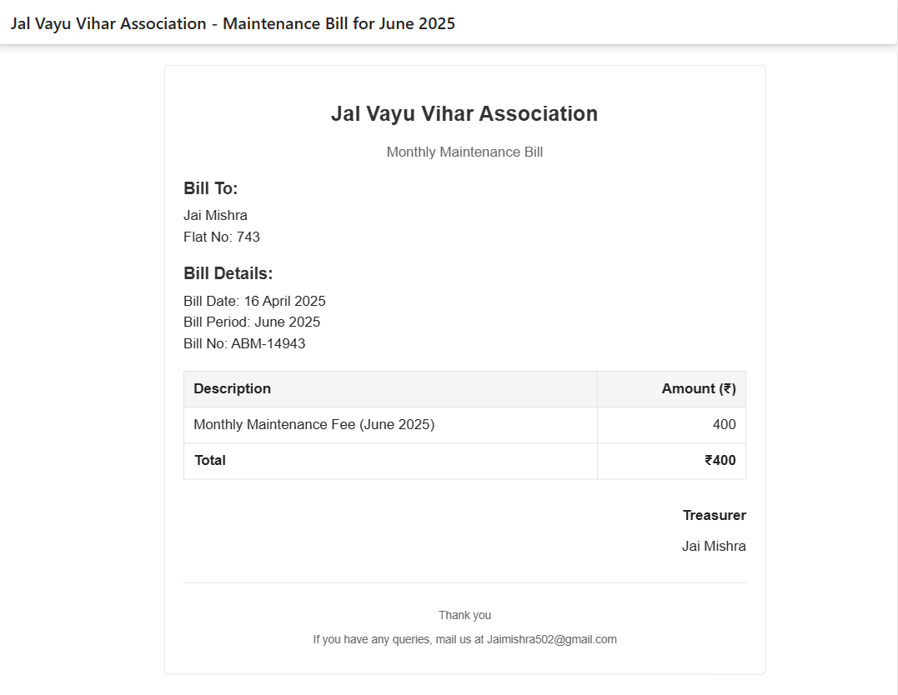

# 🏘️ Jal Vayu Vihar – Billing Management Portal

## 🏡 About

The **Jal Vayu Vihar Billing Portal** is a modern full-stack Progressive Web App (PWA) designed to automate and simplify the monthly maintenance fee collection process for residents. This project replaces traditional manual billing with an efficient digital solution.

> 🛡️ _Note: This repository and its data are private and meant only for authorized administrators._

---

## 🎯 Real World Problem Solved

Before this application:

- Bills were manually created every month — a tedious 3-day process
- Tracking payments was error-prone and difficult to audit
- Residents faced delays and confusion in receiving physical bills
- No centralized system for managing resident data and payment history

**With this portal**, administrative time is reduced to **~30 minutes per month**, while improving accuracy, transparency, and trust across the community.

---

## 🌟 Key Features

### 🔐 Secure Admin Authentication
- Admin login protected via environment variables
- JWT-based session management with secure cookies
- Unauthorized users are blocked from accessing sensitive data

### 👨‍👩‍👧‍👦 Resident Management
- Add/edit/remove residents with flat and contact details
- Smart filters and search functionality

### 📃 One-Click Monthly Bill Generation
- Automatically generate bills for all residents
- Customize amounts for individual residents
- Preview bills before sending

### 📧 Email Notifications
- Send bills directly to resident emails
- Track email delivery
- Customize email templates with branding

### 💰 Payment Tracking
- Mark bills as paid or pending
- View history by resident or date
- Generate monthly/annual reports

### 📱 Progressive Web App (PWA)
- Installable on mobile/desktop
- Offline support and fast load times
- Seamless app-like experience for admins

---

## 💻 Tech Stack

- **Frontend**: Next.js 14 (React), TypeScript, Tailwind CSS, shadcn/ui
- **Backend**: Next.js API Routes & Server Actions
- **Database**: MongoDB with Mongoose
- **Email Service**: Nodemailer
- **Authentication**: JWT with secure cookie storage
- **Deployment**: Vercel
- **PWA**: Service Worker and Web App Manifest integrated

---

## 🔧 Application Workflow

### 🔐 Admin Login

- Secure login with JWT
- Environment variable-based credentials

### 🧑‍💼 Resident Management

- CRUD operations on resident data
- Auto-form validation
- Safe destructive actions

### 📑 Bill Preview & Send

- Set amounts per resident
- Select month/year
- Preview bills before sending

### ✉️ Email Dispatch

- Bills sent via email
- Status shown post-dispatch

### ⛔ Unauthorized Access Protection

- Non-authenticated users see friendly warnings

---

## 📈 Impact

- ⏱ Reduced admin work from 3 days → **30 minutes/month**
- ✅ Increased bill delivery accuracy
- 💬 Transparent record-keeping and trust building
- 📊 Better tracking with real-time insights
- 🌱 Reduced paper usage = eco-friendly!

---

## 🚀 Future Enhancements

- Online payment integration (UPI/Credit Card)
- Resident self-service portal
- Reminder emails for unpaid dues
- Multilingual support
- Mobile app version

---

> Developed with ❤️ by **Jai Mishra** for the residents of **Jal Vayu Vihar**  
> _Empowering smarter housing societies with tech_
